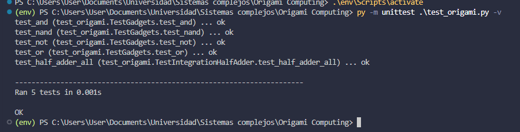
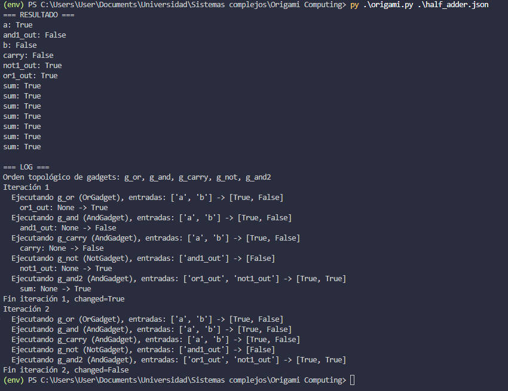

# Implementación de computación con origame

Programa que implementa una simulación de la computación mediante el origame.

## **Pruebas unitarias**
Para ejecutar las pruebas unitarias usar el comando 
``
    python -m unittest test_origami.py -v
``

> **Resultados:**

## **Ejecución de la simulación con el archivo half_adder.json**
Para ejecutar el programa correctamente usar el comando
``
py .\origami.py .\half_adder.json
``

> **Salida esperada:**

## **Propuesta de pruebas de computación**
Se podría hacer la implementación de un sumador binario usando los pliegues donde cada pliegue representa un bit y al combinar dos pliegues se podría obtener el resultado de una suma como en un sumador binario.

## Miembros del grupo

- Laura González
- Camilo Madero
- Paula Páez